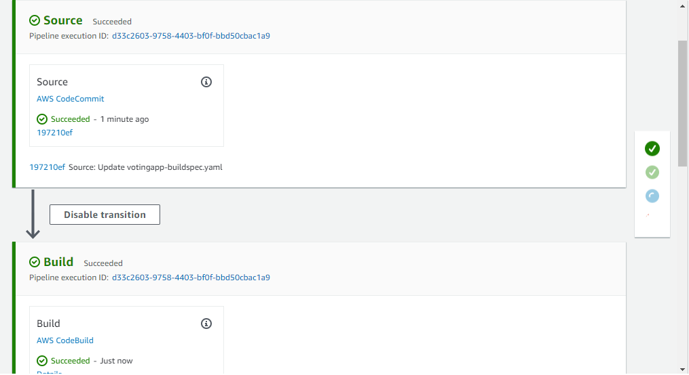
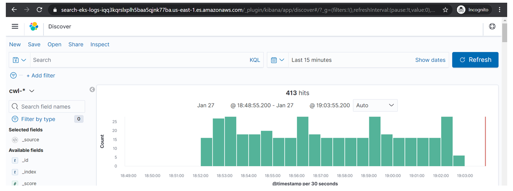

# AWS Kubernetes Offering
 

*This offering consist of implementation of reliable, secure and scalable EKS cluster and associated services on AWS cloud with  implementation of industry best practices for Kubernetes.*

AWS managed Kubernetes Service (EKS) simplifies deploying a managed Kubernetes cluster in AWS by offloading the operational overhead to AWS .  Our team of AWS certified DevOps and Solution Architects help design and implement automated setup of your application into the EKS clusters.

## Following are the deliverables as part of this offering–
-	Architecture Diagram
-	1 click re-usable infrastructure templates & install associated tools for setup of EKS cluster.
-	Automated application deployment pipelines.
-	Recommendation of relevant AWS services.
-	Observability on EKS clusters

## Value Addition
-	Efficient resource utilization- Fully managed EKS along with our automated scripts help provides efficient resource utilization that elastically provisions additional resources without the need of managing the Kubernetes infrastructure.
-	Faster application development- Automated pipelines help deploy applications till production..
-	Effective observability  helps reduce downtime and increase resilience for the production mission critical applications.

 