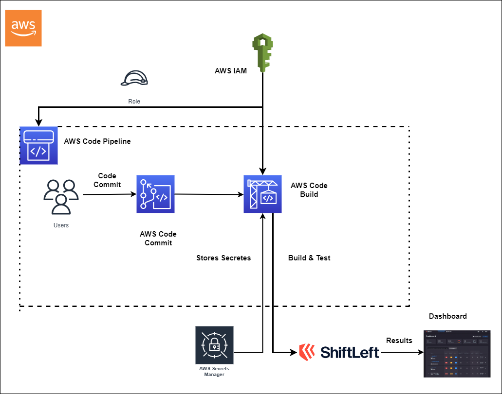

# Begin DevSecOps with AWS and ShiftLeft

Build secure apps on a trusted platform. Embed security in your developer workflow and foster collaboration with a DevSecOps framework. 

## Description
YASH entitles the organizations in their DevSecOps journey with extensive assessment services through AWS. DevSecOps (short for development, security, and operations) assists organisations in integrating security into their value delivery system while maintaining the consistency, governance, efficiency, size, and speed associated with software development. No matter what stage you are in the journey of DevSecOps, YASH will assist you by evaluating your existing environment against People, Process, Technology, and Culture. Our expertise in Azure DevSecOps Services is to automate and streamline operations for enterprise development and delivery needs. We provide a preferred roadmap on AWS with recommendations on Governance, Tooling, Processes, Architecture, and Security. We will help you to adopt a security approach with Agile and AWS DevSecOps practices, using industry standards such as OWASP risk assessment, Zero Trust, and Security tests such as SAST, IAST, DAST, and RASP.

## Agenda:
- We will provide ready-to-use templates to integrate security into DevOps by ensuring secure coding practices in the early stages of the SDLC.
- Managed services are given to support organizations on their initial setup and long-term support.
- Implant security knowledge into DevOps teams so that they can secure the pipelines they design and automate.
- Ingrain application development knowledge and automated tools and processes into security teams so that they can provide security at scale in the cloud.

## Highlights:
- Organizations release secure code at scale.
- Uses graph analysis to reveal the risk profile of a software build within minutes of a pull request.
- One easy-to-use SaaS platform for secrets detection, Intelligent SCA and developer education.
- Allow teams to control and automate the amount of risk allowed in their codebase.
- Accurate coverage for modern languages and frameworks.
- Perform dependency and license audits.
- centralized dashboard for viewing the results. 
- Focus on what is important - Not all open source vulnerabilities are reachable by attackers. SCA combined with static analysis in a single scan can reduce security tickets by 90%. 

## Key takeaways
- Increased scan and test frequencies.
- Better integration and collaboration between developers and application security.
- Improve the efficiency of the code analysis in CI/CD pipeline.
- Increased customer satisfaction. 
- Empower development and operation teams to deliver secure application.

## Architecture Diagram
 