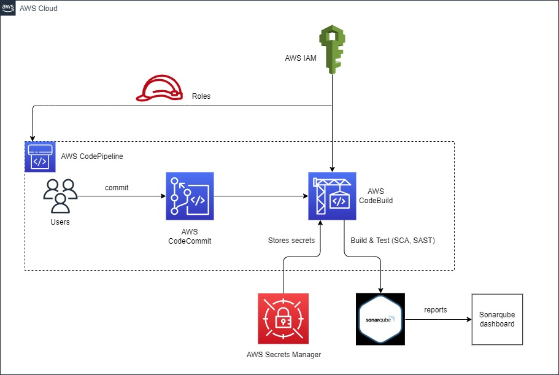

# Begin DevSecOps with AWS and SonarQube 

DevSecOps performs continuous and automated security mechanisms at the initial stages of software development and ensures security throughout the whole life cycle process. 

## Description
YASH entitles the organizations in their DevSecOps journey with extensive assessment services through AWS DevOps. No matter what stage you are in the journey of DevSecOps, YASH will assist you by evaluating your existing environment against People, Process, Technology, and Culture. Our expertise in AWS DevSecOps Services is to automate and streamline operations for enterprise development and delivery needs. We provide a preferred roadmap on AWS with recommendations on Governance, Tooling, Processes, Architecture, and Security. We will help you to adopt a security approach with Agile and AWS DevSecOps practices, using industry standards such as OWASP risk assessment, Zero Trust, and Security tests such as SAST, IAST, DAST, and RASP.

## Agenda:
- We will provide ready-to-use templates to integrate security into DevOps by ensuring secure coding practices in the early stages of the SDLC.
- Managed services are given to support organizations on their initial setup and long-term support.
- Implant security knowledge into DevOps teams so that they can secure the pipelines they design and automate.
- Ingrain application development knowledge and automated tools and processes into security teams so that they can provide security at scale in the cloud.

## Highlights:
- Custom dashboards display continuously updated, user-specified metrics that proactively notify developers and managers of issues with code as they arise.
- Powerful code analyzers to detect bugs, code smells and vulnerability issues throughout the software development lifecycle.
- Large, community-supported library of plugins and extensions allows integration with different tools used in software development.

## Benefits
- Helps the IT teams in discovering issues earlier and thus prevent bugs from passing through the development stage and appearing in the final output.
- Organizations are able to remain at the cutting edge by being able to adapt to the uncertain market requirements, innovate faster, and become more efficient in achieving their business targets.
- Process that enables accelerated application deployment.
- A reduction in issues from deployments.
- Increased customer satisfaction.

## Architecture Diagram
 