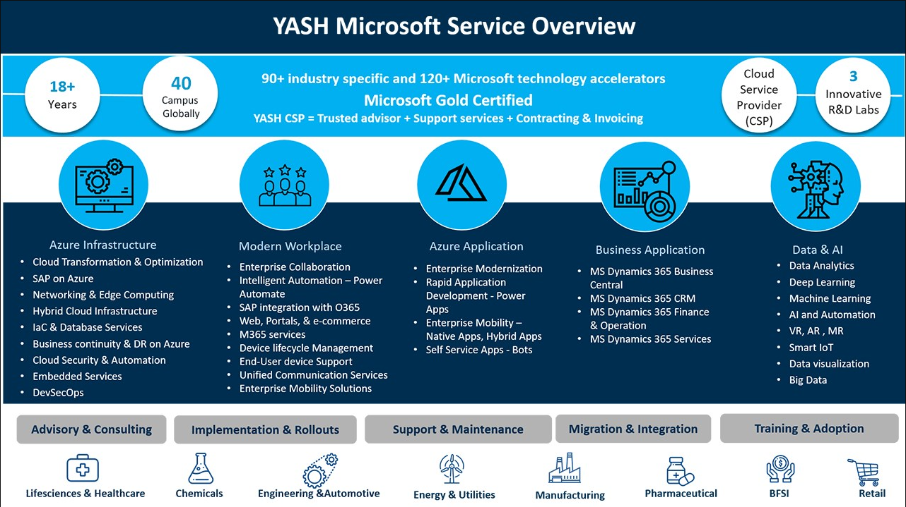
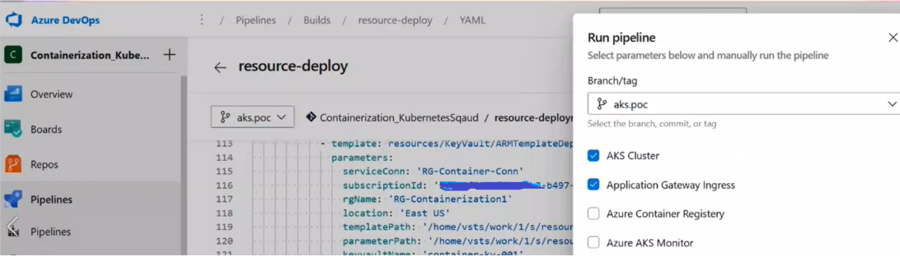
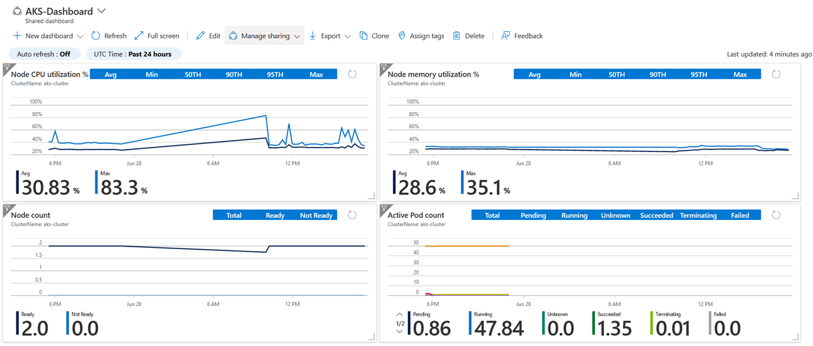

# Azure Kubernetes Offerings
 

*This offering consist of implementation of AKS cluster and associated services on Azure cloud with  implementation of industry best practices for Kubernetes.*

Azure Kubernetes Service (AKS) simplifies deploying a managed Kubernetes cluster in Azure by offloading the operational overhead to Azure.  Our team of Azure certified DevOps and Solution Architects help design and implement automated setup of your application into the Azure Kubernetes clusters.

## Following are the deliverables as part of this offering–
-	Architecture Diagram
-	1 click re-usable infrastructure templates & installation of associated tools setup on AKS cluster.
-	Automated application deployment pipelines.
-	Recommendation of relevant Azure  services.
-	Observability on AKS clusters

## Value Addition
-	Efficient resource utilization- Fully managed AKS  along with our automated scripts help provides efficient resource utilization that elastically provisions additional resources without the need of managing the Kubernetes infrastructure.
-	Faster application development- Automated pipelines help deploy applications till production..
-	Security- AKS integrates with Azure Active Directory (AD) and offers on-demand access to the users to greatly reduce threats and risks. The solution is fully compliant with System and Organization Controls (SOC), HIPAA and ISO standards.

 
 