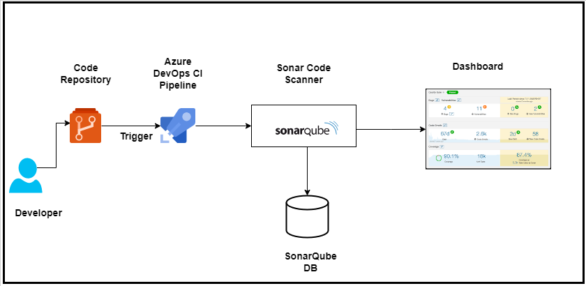
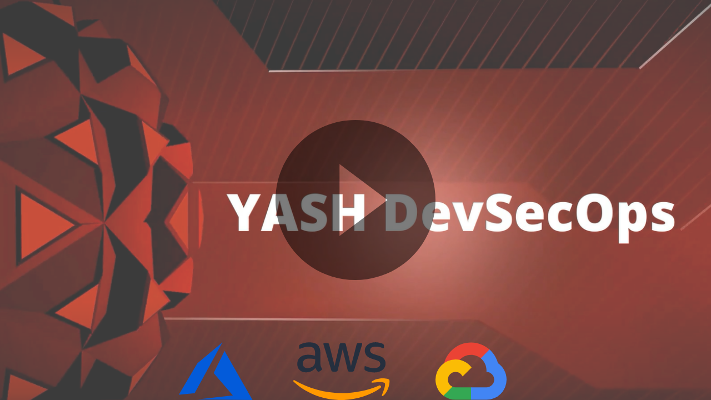

# Begin DevSecOps with Azure DevOps and SonarQube
Manage risk and application security throughout every stage of your software delivery pipeline with DevSecOps.
<!-- 
  -->

<!-- Start DevSecOps Journey with Azure DevOps & SonarQube with ready to use solution -->
## Description
<!-- SAST (Static Application Security Testing) is one of the first steps to start the DevSecOps journey. Static analysis of the code allows Developers to find security vulnerabilities in the application source code earlier in the software development life cycle.
SonarQube is opensource platform with capabilities to perform automatic static analysis of codes on 17 Programming languages.
The self-sufficient package contains all the information and ready to use pipeline code to implement SAST using SonarQube in Azure DevOps pipeline. -->
YASH entitles the organizations in their DevSecOps journey with extensive assessment services through Azure DevOps. DevSecOps (short for development, security, and operations) assists organisations in integrating security into their value delivery system while maintaining the consistency, governance, efficiency, size, and speed associated with software development. No matter what stage you are in the journey of DevSecOps, YASH will assist you by evaluating your existing environment against People, Process, Technology, and Culture. Our expertise in Azure DevSecOps Services is to automate and streamline operations for enterprise development and delivery needs. We provide a preferred roadmap on Azure with recommendations on Governance, Tooling, Processes, Architecture, and Security. We will help you to adopt a security approach with Agile and Azure DevSecOps practices, using industry standards such as OWASP risk assessment, Zero Trust, and Security tests such as SAST, IAST, DAST, and RASP.

<!-- ## Package Contents
The Self-sufficient package includes Solution Architect, user guides, Prerequisite information and installation guides, and Ready use Azure pipeline templates for different Programming languages.
## Value Addition
Package Information Document
-	Detect Bugs — SonarQube can spot complex issues and flag incorrect code.
-	Code Smells — Code smells are features of a code that signal that the programme may cause a problem in the future.
-	Security Vulnerability — SonarQube is capable of detecting security flaws in code.
-	Activate Rules Needed — Quality Profiles are a type of rule set that may be created and maintained for specific projects. This implies that a group or initiative must adhere to a set of guidelines. We can then use SonarQube to generate a Quality profile. -->
## Deliverables
-	Ready-to-use templates to integrate security into DevOps by ensuring secure coding practices in the early stages of the SDLC.
-	Managed services are given to support organizations on their initial setup and long-term support.
-	Implant security knowledge into DevOps teams so that they can secure the pipelines they design and automate.
-	Ingrain application development knowledge and automated tools and processes into security teams so that they can provide security at scale in the cloud.

## Highlights
-	Supports static code analysis in a wide range of programming languages.
-	Code analysis with security issues, code smell, and code duplication, SonarQube also provides code coverage for unit tests.
-	It stores metric history and creates charts of metric changes over time.
-	Integrates effectively with CI/CD pipelines, allowing it to automate code analysis during developer code changes. This decreases the risk of launching an application with security flaws or excessive code complexity.
-	Use third-party plugins to extend the existing capabilities.

## Key takeaways
-	Improved productivity. 
-	Cost reduction and Speed of Delivery.
-	Automation directly enables the agility and quality goals of the vision by means of replacing administrative and manual work. 
-	Increased customer satisfaction. 

## Architecture Diagram
 

