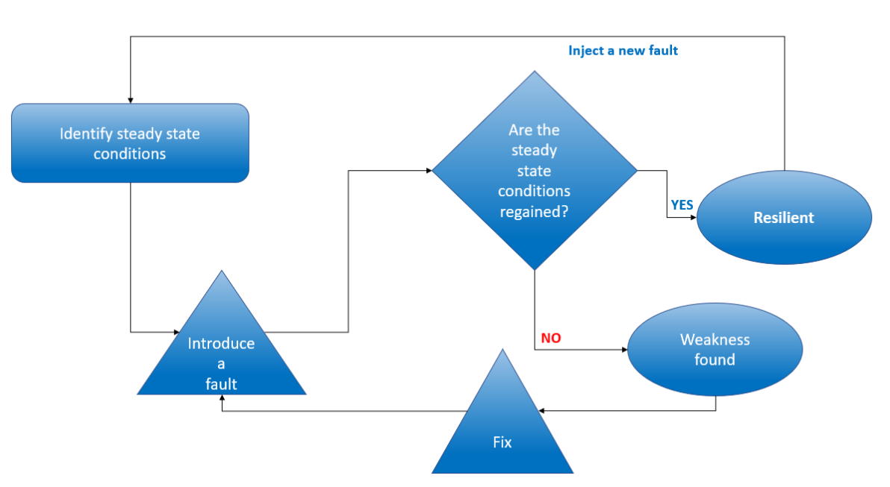
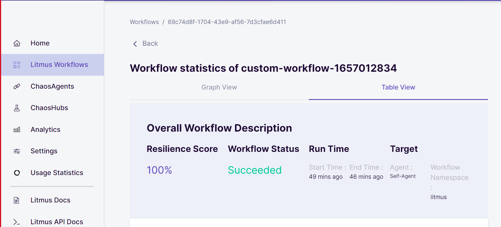

# Chaos Engineering on Kubernetes
 

*This offering consist of SRE practice for implementation of resilience into Kubernetes cluster.*

With application modernizations and migrations to the cloud,  the architecture has become complex. With such complex architecture, it is difficult to predict the failures. Any failure or outage can lead to huge revenue losses and can lead to loss of companies reputation.
 
 
Chaos Engineering is a disciplined approach to identifying systems and application failures before reaching into production and leading to an outage. With this approach, we deliberately break the application to find out how they react to failures. This help us build resilient systems.

## Following are the deliverables as part of this offering–
-	Chaos Engineering overview and understanding best practices
-	Automation scripts to setup Chaos Engineering tools.
-	Implement Chaos Pipelines (incorporation in the DevOps CI/CD pipelines)
-	Recommendation of tools/technologies

## Value Addition
-	Resiliency- Chaos Engineering increases system's resiliency and its ability to react to failures.
-	Proactive -  With introduction of simulated fault into the system, we identify single point of failures early.
-	SLA/SLO's-  Periodic validation of process and architecture help organization achieve pre-defined SLA (Service Level Agreement) & SLO (Service Level Objective) to meet specific  business objectives.

 