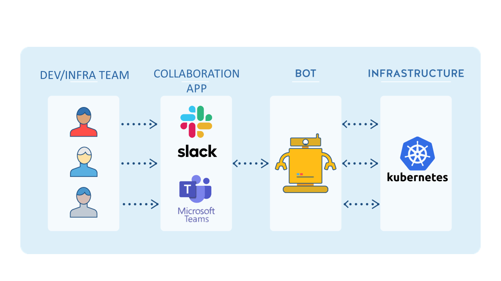
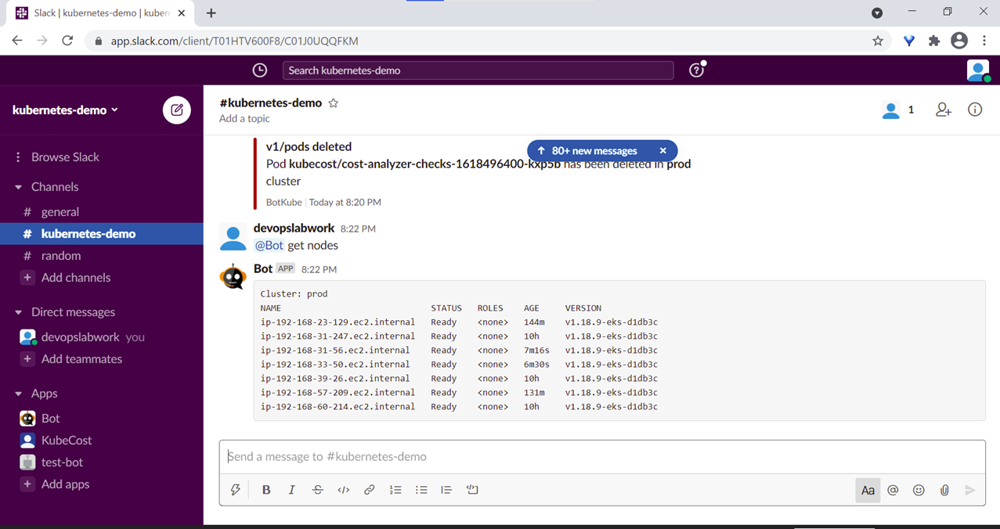

# ChatOps on Kubernetes

 

*This offering consist of implementation of ChatOps for implementation of a new way of collaboration around Kubernetes clusters.*

ChatOps is a collaboration model that connects people, tools, process, and automation into a transparent workflow.  Also known as “conversation-driven DevOps”. It accepts commands and initiate action to provide real-time information of the Kubernetes cluster.

## Following are the deliverables as part of this offering–
-	ChatOps overview and understanding implementation in the Kubernetes clusters.
-	User guide and setup process for integration of ChatOps.
-	Automation script.
-	Implementation on Slack and Microsoft Teams for 2-way communication.
 

## Value Addition
-	Automation- Provides real-time detection and execution of commands as well as events in the Kubernetes cluster
-	Collaboration: Removes silos and communication barriers between developer, operations and business teams.
-	Productivity: Enhances business processes via real-time information & communication.
-	Visibility: Implementation of ChatOps provide greater visibility of events in the Kubernetes cluster.

 