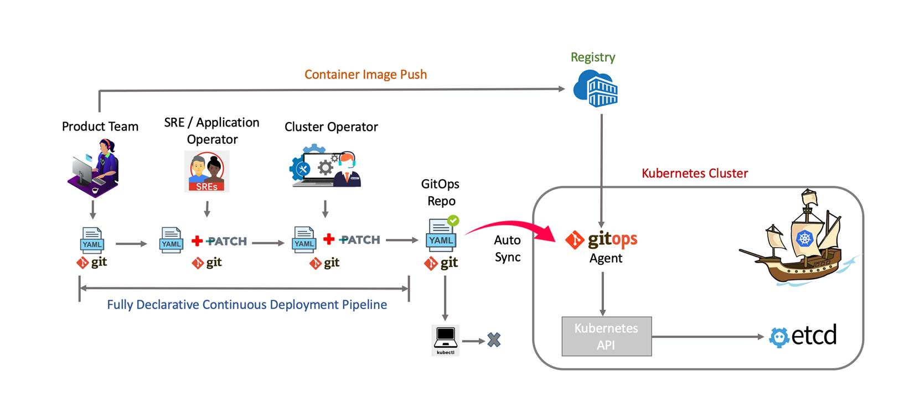

# GitOps on Kubernetes
 

*This offering consist of implementation of GitOps as a Continuous Deployment for cloud native applications in Kubernetes clusters.*

GitOps organizes the deployment process around code repositories as the central element . This allows not only allows your application team to view and better understand your deployments, but it also allows the business to answer important questions within an organization.
 
GitOps for Kubernetes places the cluster infrastructure desired state under version control. A component within the cluster continuously syncs the code. Most of the  operations happen through code changes which  can be reviewed and audited, thus ensuring in alignment with the security principle of least privilege access.

 

## Following are the deliverables as part of this offering–
-	GitOps overview and understanding best practices
-	Setup GitOps on Kubernetes clusters
-	Automation scripts
-	Implement several deployment strategies including Blue Green and Canary deployments.
-	Recommendation of tools/technologies

## Value Additions
-	Increased developer productivity - With the  use of Continuous deployment automation, the overall development output is increased 2-3x times.
-	Improved Stability- When you use Git workflows to manage your cluster, you automatically gain a convenient audit log of all cluster changes outside of Kubernetes
-	Higher Reliability - The use of GitOps, helps in reducing meantime to recovery (MTTR) from hours to minutes.
-	Faster time to ship features in production- Deployments become instant, consistent, and reliable. 

