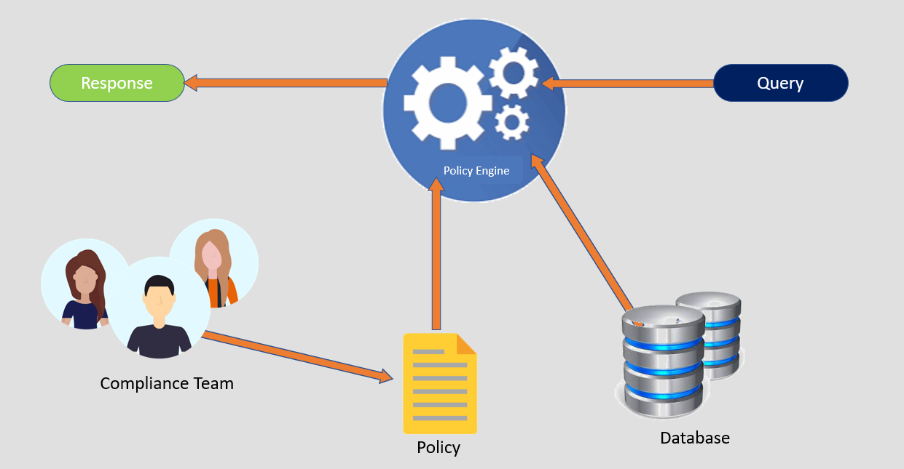
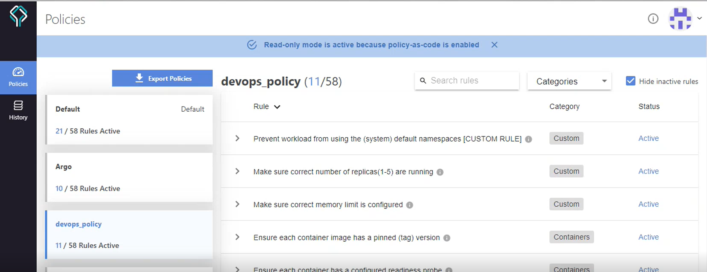

# Policy as a Code on kubernetes
 

*This offering consist of implementation of PaaC for implementation of industry best practices for Kubernetes.*

The nature of modern systems which are expected to be 24/7 available and highly scalable presents unique challenges to the development and operations teams. 
 
The operations and security team cannot monitor all container workloads manually to ensure all best practices and organizational standards are met.    Codifying and automating your operational best practices, security rules, and organizational standards is essential to ensure a healthy balance between an organization’s rate of innovation and its risk posture.

## Following are the deliverables as part of this offering–
-	PaaC overview and understanding best practices
-	Implement PaaC on Developer machines
-	Set of pre-defined and custom policies to implement best practices in the Kubernetes cluster
-	Automation scripts
-	Implement policy as a code in the CI/CD pipeline.
-	Recommendation of tools/technologies

## Value Addition
-	Reliability- PaaC ensure  in improving reliability of your business applications
-	Security- With well-defined set of rules and conditions, you can ensure security best practices are followed in your Kubernetes cluster.
-	Operational Excellence-  With implementation of organizational  rules and policies, helps in improving process excellence.

 