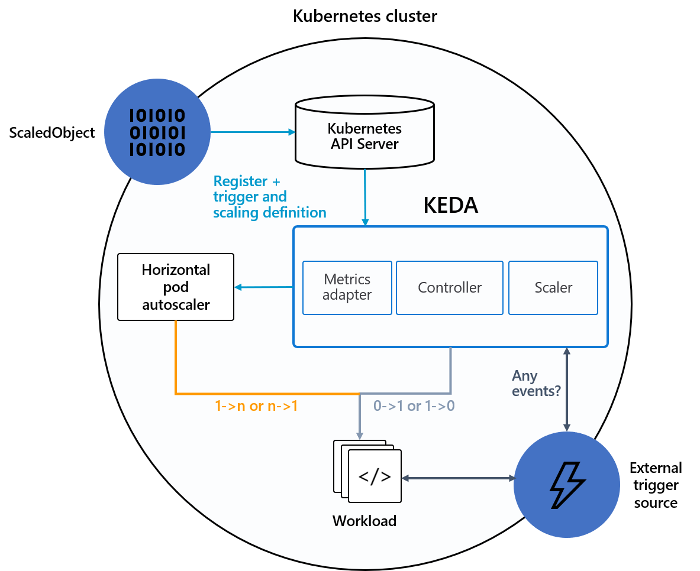
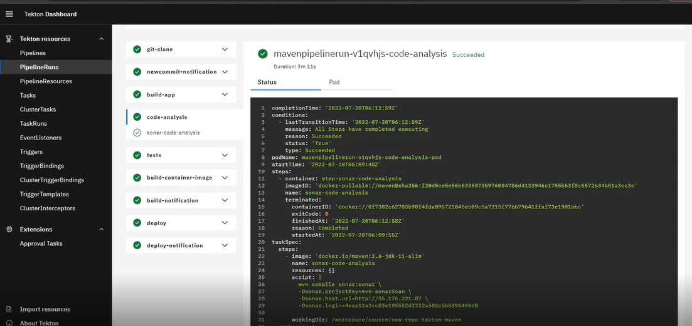

# Serverless on Kubernetes
 

*This offering consist of implementation of Serverless using industry best practices for Kubernetes.*

Serverless computing is a cloud-native execution model that makes applications even easier to develop, and more cost-effective to run. The serverless computing model help scale pods/resources based on demand and scale back to 0 when not in use.
 
Knative enables any container to run as a serverless workload on any Kubernetes cluster - whether the container is built around a serverless function, or other application code (e.g., microservices) - by abstracting away the code and handling the network routing, event triggers and autoscaling.
 
 
Knative helps developers build, deploy, and manage modern serverless workloads on Kubernetes.

## Following are the deliverables as part of this offering–
-	Overview and understanding of best practices of serverless on containers
-	Setup serverless (Knative/KEDA) using automation scripts on Kubernetes cluster
-	Serverless implementation & application scaling based on CRON, number of requests, CPU/memory etc.
-	Setup deployment strategies using Blue/Green and Canary deployments using GitOps on Kubernetes.
-	Setup of serverless cloud-native CI/CD pipelines on Kubernetes using Tekton

## Value Addition
-	Cost Optimization -  With implementation of serverless on containers, we can save cost by scaling up and down based on requirement.
-	Agent less CI/CD setup - There is no need to manage the agent for CI/CD implementation.
-	Better agility- With implementation of serverless on containers, our application resources can scale up and down based on requirement.

 