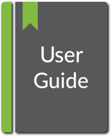
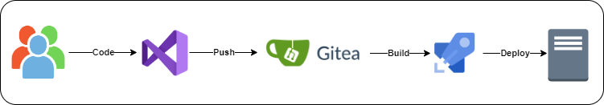

# Steps to add folder on Competencies Portal
 

## Competencies Portal 

It is a server for hosting the DevOps related offerings for the different clouds and technologies. 

## Prerequisites 

- Visual Studio Code - Or any other IDE for making changes 
- Git – For committing the changes into the Gitea server. 

## Steps to add folders on Competencies Portal

- Clone the repo from Gitea 

git clone -b docusaurus https://giteaserverdevops.tk/Yash-DevOps/Solution-Architect.git

- Create a folder in Content Management Server

**Path:** Solution-Architect/docs/foldername

- Create a JSON file "_category_.json" and add a label to it

 

- Create a Sub-Folder (i.e AWS Solution/DevSecOps)

Include a file "_category_.json"    (Add the label as per suitable naming convention) 

**Note:** The "_category_.json" file must reside under both Main and Sub-Folder.

- Now create a .md file containing the package information 

Note: Please follow the Github .md file syntax

- After making the changes commit the changes and push onto Gitea server 

git add . 
git commit -m "message"
git push origin docusaurus

## How content gets deployed on Competencies Portal 

 

The content gets deployed in 4 steps:
- User Clone the Code from Gitea Server. (Branch: docusaurus)
- Make necessary changes and Push the code back to Gitea. (Branch: docusaurus)
- The pipeline will deploy the changes on Content Management Server.
- Changes are visible on the Content Management Server.

**Note:** Pipeline will fail if image's relative path is provided incorrectly. Also edit the files carefully and make sure the syntax is correct to avoid pipeline failure.  
