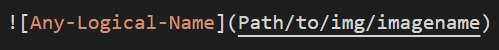
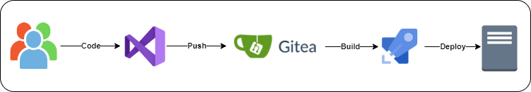

# Steps to add Images on Competencies Portal 
 

## Steps to add Images 

Images can be added in Competencies Portal using relative path:

- Relative path 

For relative path, Create a folder named "img" where solution's .md file is kept. (i.e img/arch.png)  

Now add the path in the .md file as show in below image: 

## How content gets deployed on Content Management Server 

 

The content gets deployed in 4 steps:
- User Clone the Code from Gitea Server. (Branch: docusaurus)
- Make necessary changes and Push the code back to Gitea. (Branch: docusaurus)
- The pipeline will deploy the changes on Content Management Server.
- Changes are visible on the Content Management Server.

**Note:** Pipeline will fail if image's relative path is provided incorrectly. Also edit the files carefully and make sure the syntax is correct to avoid pipeline failure.  

