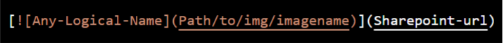

# Steps to add Videos on Competencies Portal  
 

## Steps to add Videos 

Create a thumbnail using Canva (Free-to-use online graphic design tool)

### Create thumbnail using Canva:

- In the search field type thumbnail and choose YouTube thumbnail.
- Then choose the blank template or any other template of your choice.
- In the left-hand side notice uploads section where you can upload a snapshot from your video or any other image that looks relevant to the video you are about to upload.
- Now select the image after uploading it. Adjust the image to make it fit with the template card size.
- To add a Play button click on the Element section and search for play button and add a button of your choice.
- Now as you completed the thumbnail creation part, moving ahead store it in the image folder that you already created where Solution’s .md file is kept.
- Make sure to upload the video into “sharepoint” and copy the link for further process.

Now add the path in the .md file as show in below image

- For example 

**Note:** Pipeline will fail if image's relative path is provided incorrectly. Also edit the files carefully and make sure the syntax is correct to avoid pipeline failure.  

