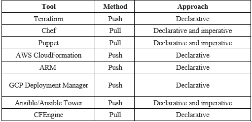

# What is Infrastructure as Code

## Introduction

- Infrastructure as Code (IaC) uses a high-level descriptive coding language to automate the provisioning of IT infrastructure. This automation eliminates the need for developers to manually provision and manage servers, operating systems, database connections, storage, and other infrastructure elements every time they want to develop, test, or deploy a software application.
- IaC is also an essential DevOps practice, indispensable to a competitively paced software delivery lifecycle. It enables DevOps teams rapidly create and version infrastructure in the same way they version source code and to track these versions so as to avoid inconsistency among IT environments that can lead to serious issues during deployment.

### Purpose
- This document is intended to provide logical description and key design components and processes followed under Infrastructure as Code (IaC) umbrella. These processes can be used to provide IaC to various projects, irrespective of technology and tools used for project Development.

### Scope
- The design can be used as reference for a project to setup required infrastructure and tools to onboard a project using IaC. This provides execution guidance for software project team irrespective of technology used for product development.

## Infrastructure as Code benefits
- `Faster time to production/market:` IaC automation dramatically speeds the process of provisioning infrastructure for development, testing, and production (and for scaling or taking down production infrastructure as needed). Because it codifies and documents everything, IaC can even automate provisioning of legacy infrastructure, which might otherwise be governed by time-consuming processes (like pulling a ticket)
- `Improved consistency:` Configuration drift occurs when ad-hoc configuration changes and updates result in a mismatched development, test, and deployment environments. This can result in issues at deployment, security vulnerabilities, and risks when developing applications and services that need to meet strict regulatory compliance standards.
- `Faster, more efficient development:` By simplifying provisioning and ensuring infrastructure consistency, IaC can confidently accelerate every phase of the software delivery lifecycle. Developers can quickly provision sandboxes and continuous integration/continuous deployment (CI/CD) environments. QA can quickly provision full-fidelity test environments. Operations can quickly provision infrastructure for security and user-acceptance testing. And when the code passes testing, the application and the production infrastructure it runs on can be deployed in one step.
- `Lower costs and improved ROI:` In addition to dramatically reducing the time, effort, and specialized skill required to provision and scale infrastructure, IaC lets organizations take maximum advantage of cloud computing’s consumption-based cost structure. It also enables developers to spend less time on plumbing and more time developing innovative, mission-critical software solutions.

## Types of approaches
There are generally two approaches to IaC:
- Declarative (functional)
- Imperative (procedural)

The difference between the declarative and the imperative approach is essentially `what` versus `how`. The declarative approach focuses on what the eventual target configuration should be; the imperative focuses on how the infrastructure is to be changed to meet this.

## Methods
There are two methods of IaC:
- Push
- Pull

The main difference is the manner in which the servers are told how to be configured. In the pull method the server to be configured will pull its configuration from the controlling server. In the push method the controlling server pushes the configuration to the destination system.

## Tools
There are many tools that fulfill infrastructure automation capabilities and use IaC. Here is a list of the top IaC tools currently on the market.

