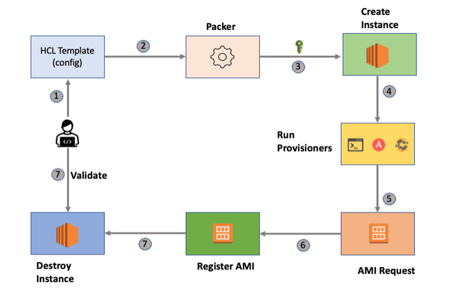

# Creating Pre-baked Images Using Hashicorp Packer

 

# Description
- This offering consists of the accomplishment of Packer to create Pre-backed/Pre-configured images that can utilize to launch entirely provisioned and configured Servers. Packer creates identical images for multiple platforms like we can run production in AWS, staging/QA in a private cloud like OpenStack, and development in VMware or VirtualBox. 
 
# Our Solution
- Solution Architectures.
- Implementation Strategy with industry-standard best practices.
- Pre-defined and Dynamic Packer templates to make Golden images.     
- Ready to use pipelines template supported by most popular CICD tools
- Integration document with various tools.

# Vaule Addition
- Super-fast infrastructure deployment: Pre-define and Dynamic templates help achieve production deadlines.
- Improved stability: Pre-configured images help smartly identify bugs in the early stage of development.
- Reliability: Packer helps to improve the reliability by validating the images. 
- Security: Ready templates with Security best practices. 