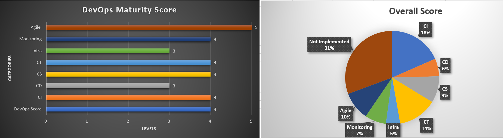

# DevOps Maturity Model 

<!--  -->

DevOps Assessment: Assess, Analyze, Implement, Achieve!

## Description

DevOps Maturity is described as a model that decides an organization's standing in DevOps journey along with deciding what more to be implemented to achieve the desired results.
DevOps Maturity Models acts as a tool to access the effectiveness of the organizational processes. 
These processes include:

- Adoption of certain business practices
- Identifying the capabilities required to:
  * Improve performance
  * Reach a higher maturity level

## Package Contents

It includes a file where all questions have been asked from all the DevOps processes. i.e CI/CD/CS/CT etc.
Answer is captured in the form of Yes/No and after answering the questions it will generate a Maturity Score as shown in below image:

 

## Value Addition

- Faster adaptability to change
- Ability to tap opportunities
- Identifying areas of fulfillment
- Improved scalability
- Operational efficiency
- Increased delivery speeds
- Enhanced quality